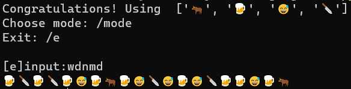

# Language_77


用你喜欢的字编码任何字符串！

Use any word list to encode and decode string!

+ 灵感来源：兽音译者

+ 实现原理：标准编码后进制互换
+ 功能：不仅可以单符号转单符号，还可单符号转多符号。




## 使用

实例化：

```python
A = Switcher_77(words=['🐂', '🍺', '😅', '🔪'], encode='u8')
```

编码：

```python
A.encode("your words")
```

解码：

```python
A.decode("xxxxxxxxxx")
```


> 栗子：
>
> 用 **['绝绝子', '好喝到', '跺', 'jio', '暴风吸入']**
>
> 编码 **'无内鬼，开始交易'**
>
> 编码结果：
>
> >暴风吸入暴风吸入jio暴风吸入跺暴风吸入暴风吸入绝绝子jio跺暴风吸入jio好喝到暴风吸入暴风吸入跺好喝到jiojio绝绝子暴风吸入jio暴风吸入绝绝子绝绝子暴风吸入绝绝子绝绝子跺暴风吸入绝绝子跺跺暴风吸入暴风吸入绝绝子暴风吸入暴风吸入跺暴风吸入好喝到jio好喝到暴风吸入好喝到jio跺跺绝绝子jiojiojio好喝到跺绝绝子
>
> 解码：
>
> > 无内鬼，开始交易


> Example:
>
> Use **['I', 'love', '77', 'because', 'she', 'is', 'cute']** these words to 
>
> encode **'Solitary cloud,Shadow in the setting sun,Stirs the drifter's heart.'**:
>
> encoded:
>
> > 77becausecutebecausebecausecutecuteisbecausebecausecute7777isshebecauseshelove77because77lovesheshe77cutebecausecuteIlovesheIlovebecause77lovelove77shelovelovelovebecauseIiscuteisislovecutebecausecute77lovecutesheshecutelovesheshelovebecausebecauseisbecauseI77lovecuteislovesheIcuteisshebecauseI77becauseisisIsheshecutelovebecauseis77lovesheisloveloveisbecausecute7777becausesheloveisIisshebecauseIisisIcutebecausecuteshe7777iscuteshebecausebecausebecauseII77cuteloveIsheI77lovelovecutebecauseI77becauseisbecauselovelovebecauseshelove77sheisisloveislovecuteIisshecutelovebecause77sheisiscuteislovesheloveisbecauseloveloveshebecauseissheloveshesheisIIiscute77loveis77
>
> decoded:
>
> > Solitary cloud,Shadow in the setting sun,Stirs the drifter's heart.
